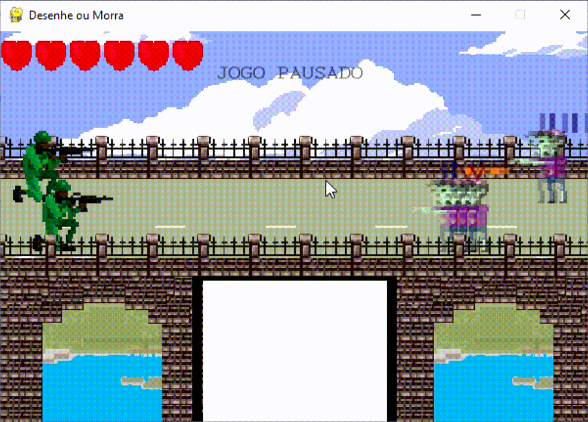

# Desenhe-ou-Morra

# Introdução
Nesse game, o jogador deve desenhar os "sinais" que aparecem na cabeça dos zumbis para matá-los.

A inspiração veio do jogo "gatinho feiticeiro" da Google , link: https://www.google.com/doodles/halloween-2016 .
# Como jogar

Para desenhar, é necessário dar um clique dentro da área e depois dar outro clique para finalizar, ou seja, não é preciso manter o mouse pressionado.
- Para dar pause ou retirar do pause é so teclar "p".
# Bibliotecas
As seguintes bibliotecas são necessárias para que o jogo funcione.

Criado com Python 3.8.3

Tensorflow: https://www.tensorflow.org/install/pip?hl=pt-br#virtual-environment-install

Numpy: https://pypi.org/project/numpy/

Pygame: https://pypi.org/project/pygame/

Pillow: https://pillow.readthedocs.io/en/stable/installation.html
# Treinamento da CNN
As imagens para o treinamento da CNN estão na pasta "Dataset". Caso queira treinar o seu próprio modelo e usar no Jogo, é so utilizar o script "Treinar CNN". As arquiteturas e avaliações dos meus 2 modelos estão na pasta "Modelos e avaliações".

- Foram utilizadas 2100 imagens para o treinamento e 900 para teste.

# Observações
- Para que o jogo funcione corretamente, você não deve movimentar a tela. :confused:

- Ele da uma leve travadinha no primeiro desenho ...

- Nenhuma das pixel arts foram de minha autoria.

- Espero que você se divirta :blush:
